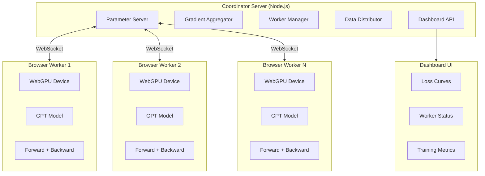

# WebGPU Distributed Training — Implementation Plan

> Port Karpathy's autoresearch GPT training to WebGPU and enable distributed data-parallel training across a swarm of browser-based workers.

## Architecture Overview



## Data-Parallel Training Protocol

```
1. Coordinator broadcasts current parameters to all workers
2. Each worker receives a unique data batch
3. Workers compute forward + backward pass on WebGPU
4. Workers send gradients to coordinator
5. Coordinator averages gradients (all-reduce)
6. Coordinator applies optimizer step
7. Goto 1
```

## Technology Stack

| Component | Technology |
|-----------|-----------|
| GPU Compute | WebGPU + WGSL shaders |
| Frontend | TypeScript + Vite |
| Server | Node.js + Express + ws |
| Communication | WebSocket (binary protocol) |
| Styling | Vanilla CSS (premium dark theme) |
| Charting | Canvas-based (custom) |

## Project Structure

```
webgpu-distributed/
├── package.json
├── vite.config.ts
├── tsconfig.json
├── server/
│   ├── index.ts              # Express + WebSocket server
│   ├── parameter-server.ts   # Model parameter management
│   ├── gradient-aggregator.ts # Gradient averaging
│   ├── data-distributor.ts   # Batch distribution
│   └── protocol.ts           # Binary message format
├── src/
│   ├── gpu/
│   │   ├── device.ts         # WebGPU device init
│   │   ├── tensor.ts         # GPU tensor class
│   │   ├── ops.ts            # Tensor operations
│   │   └── shaders/
│   │       ├── matmul.wgsl
│   │       ├── attention.wgsl
│   │       ├── elementwise.wgsl
│   │       ├── embedding.wgsl
│   │       ├── normalization.wgsl
│   │       ├── softmax.wgsl
│   │       ├── cross_entropy.wgsl
│   │       └── rotary.wgsl
│   ├── model/
│   │   ├── config.ts         # GPTConfig
│   │   ├── gpt.ts            # Full GPT model
│   │   ├── attention.ts      # CausalSelfAttention
│   │   ├── mlp.ts            # MLP block
│   │   └── embedding.ts      # Token + positional embeddings
│   ├── train/
│   │   ├── trainer.ts        # Training loop
│   │   ├── optimizer.ts      # AdamW optimizer
│   │   └── scheduler.ts      # LR schedule
│   ├── distributed/
│   │   ├── worker-client.ts  # WebSocket worker client
│   │   └── protocol.ts       # Shared protocol types
│   ├── ui/
│   │   ├── dashboard.ts      # Dashboard components
│   │   ├── worker-ui.ts      # Worker status UI
│   │   └── charts.ts         # Loss curve charts
│   ├── worker.ts             # Worker entry point
│   └── dashboard.ts          # Dashboard entry point
├── worker.html               # Worker page
└── index.html                # Dashboard page
```

## Key Design Decisions

### 1. Simplified Model for WebGPU
- Use **f32** (WebGPU's f16 support is limited/optional)
- Replace Flash Attention 3 with a **naive causal attention** (WGSL shader)
- Simplify optimizer to **AdamW only** (Muon requires SVD-like ops)
- Smaller default model (depth=4, ASPECT_RATIO=32) for browser performance

### 2. Gradient Compression
- Send **f16 gradients** over WebSocket to reduce bandwidth
- Optional top-k sparsification for slow connections

### 3. Fault Tolerance
- Workers can join/leave at any time
- Coordinator tracks active workers and adjusts batch distribution
- Stale gradients are discarded (staleness threshold)

## Implementation Phases

### Phase 1: WebGPU Tensor Library + Shaders ✏️
Core WGSL compute shaders and a TypeScript Tensor class wrapping GPUBuffer.

### Phase 2: GPT Model Port
Port GPTConfig, Embedding, Attention, MLP, and full GPT forward pass.

### Phase 3: Backward Pass (Autograd)
Lightweight autograd system for computing gradients through the model.

### Phase 4: Coordinator Server
Parameter server, gradient aggregation, data distribution, WebSocket protocol.

### Phase 5: Distributed Worker
Browser-based worker that connects, receives params, trains, sends gradients.

### Phase 6: Dashboard UI
Beautiful real-time dashboard showing workers, loss curves, throughput.

### Phase 7: Polish + Optimization
Gradient compression, fault tolerance, performance tuning.
