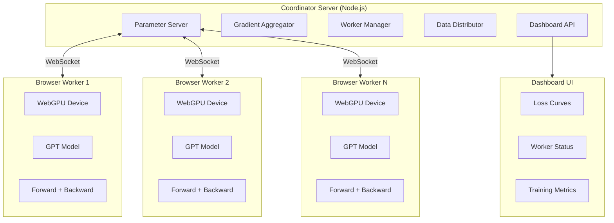

# WebGPU Distributed Training — Implementation Plan

> Port Karpathy's autoresearch GPT training to WebGPU and enable distributed data-parallel training across a swarm of browser-based workers.

## Architecture Overview



## Data-Parallel Training Protocol

```
1. Coordinator broadcasts current parameters to all workers
2. Each worker receives a unique data batch
3. Workers compute forward + backward pass on WebGPU
4. Workers send gradients to coordinator
5. Coordinator averages gradients (all-reduce)
6. Coordinator applies optimizer step
7. Goto 1
```

## Technology Stack

| Component | Technology |
|-----------|-----------|
| GPU Compute | WebGPU + WGSL shaders |
| Frontend | TypeScript + Vite |
| Server | Node.js + Express + ws |
| Communication | WebSocket (binary protocol) |
| Styling | Vanilla CSS (premium dark theme) |
| Charting | Canvas-based (custom) |

## Project Structure

```
webgpu-distributed/
├── package.json
├── vite.config.ts
├── tsconfig.json
├── server/
│   ├── index.ts              # Express + WebSocket server
│   ├── parameter-server.ts   # Model parameter management
│   ├── gradient-aggregator.ts # Gradient averaging
│   ├── data-distributor.ts   # Batch distribution
│   └── protocol.ts           # Binary message format
├── src/
│   ├── gpu/
│   │   ├── device.ts         # WebGPU device init
│   │   ├── tensor.ts         # GPU tensor class
│   │   ├── ops.ts            # Tensor operations
│   │   └── shaders/
│   │       ├── matmul.wgsl
│   │       ├── attention.wgsl
│   │       ├── elementwise.wgsl
│   │       ├── embedding.wgsl
│   │       ├── normalization.wgsl
│   │       ├── softmax.wgsl
│   │       ├── cross_entropy.wgsl
│   │       └── rotary.wgsl
│   ├── model/
│   │   ├── config.ts         # GPTConfig
│   │   ├── gpt.ts            # Full GPT model
│   │   ├── attention.ts      # CausalSelfAttention
│   │   ├── mlp.ts            # MLP block
│   │   └── embedding.ts      # Token + positional embeddings
│   ├── train/
│   │   ├── trainer.ts        # Training loop
│   │   ├── optimizer.ts      # AdamW optimizer
│   │   └── scheduler.ts      # LR schedule
│   ├── distributed/
│   │   ├── worker-client.ts  # WebSocket worker client
│   │   └── protocol.ts       # Shared protocol types
│   ├── ui/
│   │   ├── dashboard.ts      # Dashboard components
│   │   ├── worker-ui.ts      # Worker status UI
│   │   └── charts.ts         # Loss curve charts
│   ├── worker.ts             # Worker entry point
│   └── dashboard.ts          # Dashboard entry point
├── worker.html               # Worker page
└── index.html                # Dashboard page
```

## Key Design Decisions

### 1. Simplified Model for WebGPU
- Use **f32** (WebGPU's f16 support is limited/optional)
- Replace Flash Attention 3 with a **naive causal attention** (WGSL shader)
- Simplify optimizer to **AdamW only** (Muon requires SVD-like ops)
- Smaller default model (depth=4, ASPECT_RATIO=32) for browser performance

### 2. Gradient Compression
- Send **f16 gradients** over WebSocket to reduce bandwidth
- Optional top-k sparsification for slow connections

### 3. Fault Tolerance
- Workers can join/leave at any time
- Coordinator tracks active workers and adjusts batch distribution
- Stale gradients are discarded (staleness threshold)

## Production Roadmap & Next Steps

Ranked by the highest value for taking this distributed WebGPU training to production.

### Priority 1: Full backward pass on WebGPU
**Value:** Absolute Blocker. We cannot train a model without computing real gradients.
- [ ] Scaffold the automatic differentiation (autograd) graph in the `Tensor` class.
- [ ] Implement WGSL shaders for backward operations (e.g., `matmul_backward`, `attention_backward`, `layernorm_backward`).
- [ ] Wire the cross-entropy loss output back to the model parameters in the training loop.
- [ ] Validate gradients against a PyTorch reference for identical inputs.

### Priority 2: Gradient compression
**Value:** High. Raw parameter gradients are too large for efficient WebRTC transfer. Compression unlocks fast iteration speeds.
- [ ] Implement `f32` to `f16` quantization and dequantization in JavaScript/WGSL.
- [ ] Create a Top-K sparsification compute shader to identify and extract only the most significant gradient values.
- [ ] Update the WebRTC data channel payload serialization to pack and unpack the compressed and sparsified tensors.

### Priority 3: TURN server support & Cross-network training
**Value:** High. Browsers behind symmetric NATs (corporate networks, strict firewalls) will fail to connect P2P without TURN.
- [ ] Deploy a Coturn server or provision a cloud TURN provider (e.g., Twilio, Metered).
- [ ] Update the `RTCPeerConnection` configuration in `webrtc-mesh.ts` to include TURN credentials.
- [ ] Deploy the Node.js signaling server (`server/signaling.ts`) to a public endpoint (e.g., Render, Fly.io) to allow workers from different networks to discover each other.

### Priority 4: Dynamic ring reformation
**Value:** Medium-High. Essential for swarm stability. If a single tab closes, the current ring hangs. 
- [ ] Add strict timeout detection during `Reduce-Scatter` and `All-Gather` phases.
- [ ] Implement a lightweight heartbeat mechanism between peers and the signaling server.
- [ ] Automatically trigger ring rebuilding when a peer drops, discard the failed step's gradients, and seamlessly resume the training loop.

### Priority 5: Checkpoint saving
**Value:** Medium. Needed to extract the trained model and actually use the computation results.
- [ ] Implement weight serialization into a standard format (e.g., `.safetensors` or raw binary).
- [ ] Add an "Export Checkpoint" button in the Dashboard/Worker UI.
- [ ] Allow downloading the serialized Blob directly from the browser memory.
