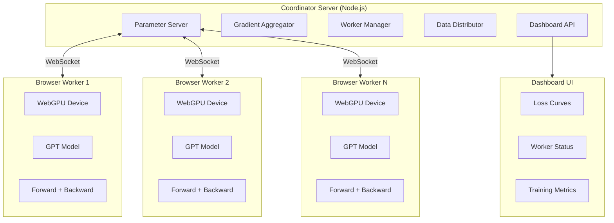

# WebGPU Distributed Training — Implementation Plan

> Port Karpathy's autoresearch GPT training to WebGPU and enable distributed data-parallel training across a swarm of browser-based workers.

## Current Focus — Karpathy Parity (2026-03-21)

Primary goal: close the highest-impact implementation gaps against `karpathy/autoresearch` while preserving the browser/WebGPU/WebRTC architecture.

### Active Parity Workstreams

- [ ] Data pipeline parity
  - [ ] Replace flat sequential token batching with BOS-aligned best-fit document packing.
  - [ ] Support document-oriented token inputs in the browser data path.
  - [ ] Keep validation batching compatible with Karpathy-style held-out evaluation.

- [ ] Model parity
  - [ ] Implement value embeddings / gated value residuals.
  - [ ] Make `windowPattern` affect attention semantics instead of acting as config-only metadata.
  - [ ] Correctly support `nKvHead < nHead` for GQA-style attention.

- [ ] Trainer parity
  - [ ] Replace approximate BPB with token-byte-aware BPB.
  - [ ] Improve LR scheduling toward Karpathy-style warmup / warmdown behavior.
  - [ ] Integrate improved data/model surfaces without regressing checkpointing or UI flows.

- [ ] Prepare/tokenizer parity
  - [ ] Persist tokenizer artifacts needed downstream, not just shard bins.
  - [ ] Emit metadata for BOS/special-token IDs and token byte lengths.
  - [ ] Keep large-shard WASM tokenization stable under browser/Node memory limits.

### Constraints

- We are intentionally not copying CUDA-specific implementation details literally.
- FlashAttention, `torch.compile`, bf16 autocast, and Muon need browser-appropriate equivalents rather than direct ports.
- `PLAN.md` and `TIMELINE.md` are maintained on the main thread to avoid merge conflicts while subagents work in parallel.

## Architecture Overview



## Data-Parallel Training Protocol

```
1. Coordinator broadcasts current parameters to all workers
2. Each worker receives a unique data batch
3. Workers compute forward + backward pass on WebGPU
4. Workers send gradients to coordinator
5. Coordinator averages gradients (all-reduce)
6. Coordinator applies optimizer step
7. Goto 1
```

## Technology Stack

| Component | Technology |
|-----------|-----------|
| GPU Compute | **TensorFlow.js** (`@tensorflow/tfjs-backend-webgpu`) |
| Frontend | TypeScript + Vite |
| Server | Node.js + Express + ws |
| Communication | WebRTC (DataChannels P2P) + WebSocket signaling |
| Styling | Vanilla CSS (premium dark theme) |
| Charting | Canvas-based (custom) |

## Production Roadmap & Next Steps

Ranked by the highest value for taking this distributed training to production.

### Priority 1: Port GPT Model to TensorFlow.js (Base Completed)
**Value:** Massive architectural win. Replaces fragile WGSL shaders with robust TFJS ops offering free automatic differentiation.
- [x] Baseline TFJS rewrite with `tf.variableGrads` and `tf.train.adamw`.
- [ ] Add `tf.profile()` instrumentation to catch memory leaks in async flows.
- [ ] Implement a lightweight WebGPU fallback path for unstable browsers (Safari/Old Chromium).
- [ ] Add explicit weight initialization logic to exactly match PyTorch defaults for convergence parity.

### Priority 2: Gradient Correctness Validation (NEW - Critical Blocker)
**Value:** Absolute necessity before optimizing compression. Ring allreduce bugs and TFJS initialization differences are silent and subtle.
- [ ] Create a PyTorch reference script for a single forward/backward pass.
- [ ] Add a `validate_gradients()` mode to compare single-peer TFJS gradients against PyTorch on the exact same batch.
- [ ] Assert identical loss and gradient L2 norms.

### Priority 3: Gradient Compression
**Value:** High. Raw parameter gradients are too large for efficient WebRTC transfer.
- [x] Initial `f32` to `f16` quantization using `Float16Array` + SCTP streaming.
- [ ] Implement **dynamic loss scaling** to detect and recover from f16 underflow during training.
- [ ] Implement Top-K sparsification (Global aggregate vs Local per peer topology design).
- [ ] Add an **error feedback buffer** (residual accumulation) so dropped gradients in sparsification don't permanently bias the model.

### Priority 4: Observability / Training Dashboard (NEW)
**Value:** Indispensable. Without this, debugging ring failures or compression artifacts in a distributed browser environment is nearly impossible.
- [ ] Track and visualize loss curve over time.
- [ ] Track gradient norms and step latencies.
- [ ] Visualize peer count and ring health.

### Priority 5: Dynamic ring reformation
**Value:** Medium-High. Essential for swarm stability. If a single tab closes, the current ring hangs.
- [ ] Implement dynamically tuned heartbeat intervals tied to the expected step latency.
- [ ] Add a minimum ring size threshold to pause training rather than continuing with degraded bandwidth.
- [ ] Handle peer drops mid-Reduce-Scatter by gracefully aborting the step and recomputing rather than using partial gradients.

### Priority 6: TURN server support & Cross-network training
**Value:** High. Browsers behind symmetric NATs will fail to connect P2P without TURN.
- [ ] Integrate Cloudflare Calls or Metered.ca as managed TURN alternatives.
- [ ] Implement credential rotation (short-lived TURN tokens via HMAC) at the signaling layer.
- [ ] Add the concept of "Rooms/Sessions" to the signaling server to run multiple independent training rings simultaneously.

### Priority 7: Checkpoint saving
**Value:** Medium. Needed to extract the trained model and resume computation.
- [ ] Serialize weights into `.safetensors`.
- [ ] Serialize **optimizer state** (Adam moments) to avoid warm-up penalties on resumption.
- [ ] Implement a checkpoint versioning scheme (e.g., timestamp + step number in filename).

# WebGPU Distributed Training — Implementation Plan

> Port Karpathy's autoresearch GPT training to WebGPU and enable distributed data-parallel training across a swarm of browser-based workers.

## Architecture Overview


## Data-Parallel Training Protocol

```
1. Coordinator broadcasts current parameters to all workers
2. Each worker receives a unique data batch
3. Workers compute forward + backward pass on WebGPU
4. Workers send gradients to coordinator
5. Coordinator averages gradients (all-reduce)
6. Coordinator applies optimizer step
7. Goto 1
```

## Technology Stack

| Component | Technology |
|-----------|-----------|
| GPU Compute | WebGPU + WGSL shaders |
| Frontend | TypeScript + Vite |
| Server | Node.js + Express + ws |
| Communication | WebSocket (binary protocol) |
| Styling | Vanilla CSS (premium dark theme) |
| Charting | Canvas-based (custom) |

## Project Structure

```
/
├── package.json
├── vite.config.ts
├── tsconfig.json
├── server/
│   ├── index.ts              # Express + WebSocket server
│   ├── parameter-server.ts   # Model parameter management
│   ├── gradient-aggregator.ts # Gradient averaging
│   ├── data-distributor.ts   # Batch distribution
│   └── protocol.ts           # Binary message format
├── src/
│   ├── gpu/
│   │   ├── device.ts         # WebGPU device init
│   │   ├── tensor.ts         # GPU tensor class
│   │   ├── ops.ts            # Tensor operations
│   │   └── shaders/
│   │       ├── matmul.wgsl
│   │       ├── attention.wgsl
│   │       ├── elementwise.wgsl
│   │       ├── embedding.wgsl
│   │       ├── normalization.wgsl
│   │       ├── softmax.wgsl
│   │       ├── cross_entropy.wgsl
│   │       └── rotary.wgsl
│   ├── model/
│   │   ├── config.ts         # GPTConfig
│   │   ├── gpt.ts            # Full GPT model
│   │   ├── attention.ts      # CausalSelfAttention
│   │   ├── mlp.ts            # MLP block
│   │   └── embedding.ts      # Token + positional embeddings
│   ├── train/
│   │   ├── trainer.ts        # Training loop
│   │   ├── optimizer.ts      # AdamW optimizer
│   │   └── scheduler.ts      # LR schedule
│   ├── distributed/
│   │   ├── worker-client.ts  # WebSocket worker client
│   │   └── protocol.ts       # Shared protocol types
│   ├── ui/
│   │   ├── dashboard.ts      # Dashboard components
│   │   ├── worker-ui.ts      # Worker status UI
│   │   └── charts.ts         # Loss curve charts
│   ├── worker.ts             # Worker entry point
│   └── dashboard.ts          # Dashboard entry point
├── worker.html               # Worker page
└── index.html                # Dashboard page
```

## Key Design Decisions

### 1. Simplified Model for WebGPU
- Use **f32** (WebGPU's f16 support is limited/optional)
- Replace Flash Attention 3 with a **naive causal attention** (WGSL shader)
- Simplify optimizer to **AdamW only** (Muon requires SVD-like ops)
- Smaller default model (depth=4, ASPECT_RATIO=32) for browser performance

### 2. Gradient Compression
- Send **f16 gradients** over WebSocket to reduce bandwidth
- Optional top-k sparsification for slow connections

### 3. Fault Tolerance
- Workers can join/leave at any time
- Coordinator tracks active workers and adjusts batch distribution
- Stale gradients are discarded (staleness threshold)

## Production Roadmap & Next Steps

Ranked by the highest value for taking this distributed training to production.

### Priority 1: Port GPT Model to TensorFlow.js (Base Completed)
**Value:** Massive architectural win. Replaces fragile WGSL shaders with robust TFJS ops offering free automatic differentiation.
- [x] Baseline TFJS rewrite with `tf.variableGrads` and `tf.train.adamw`.
- [ ] Add `tf.profile()` instrumentation to catch memory leaks in async flows.
- [ ] Implement a lightweight WebGPU fallback path for unstable browsers (Safari/Old Chromium).
- [ ] Add explicit weight initialization logic to exactly match PyTorch defaults for convergence parity.

### Priority 2: Gradient Correctness Validation (NEW - Critical Blocker)
**Value:** Absolute necessity before optimizing compression. Ring allreduce bugs and TFJS initialization differences are silent and subtle.
- [ ] Create a PyTorch reference script for a single forward/backward pass.
- [ ] Add a `validate_gradients()` mode to compare single-peer TFJS gradients against PyTorch on the exact same batch.
- [ ] Assert identical loss and gradient L2 norms.

### Priority 3: Gradient Compression
**Value:** High. Raw parameter gradients are too large for efficient WebRTC transfer.
- [x] Initial `f32` to `f16` quantization using `Float16Array` + SCTP streaming.
- [ ] Implement **dynamic loss scaling** to detect and recover from f16 underflow during training.
- [ ] Implement Top-K sparsification (Global aggregate vs Local per peer topology design).
- [ ] Add an **error feedback buffer** (residual accumulation) so dropped gradients in sparsification don't permanently bias the model.

### Priority 4: Observability / Training Dashboard (NEW)
**Value:** Indispensable. Without this, debugging ring failures or compression artifacts in a distributed browser environment is nearly impossible.
- [ ] Track and visualize loss curve over time.
- [ ] Track gradient norms and step latencies.
- [ ] Visualize peer count and ring health.

### Priority 5: Dynamic ring reformation
**Value:** Medium-High. Essential for swarm stability. If a single tab closes, the current ring hangs.
- [ ] Implement dynamically tuned heartbeat intervals tied to the expected step latency.
- [ ] Add a minimum ring size threshold to pause training rather than continuing with degraded bandwidth.
- [ ] Handle peer drops mid-Reduce-Scatter by gracefully aborting the step and recomputing rather than using partial gradients.

### Priority 6: TURN server support & Cross-network training
**Value:** High. Browsers behind symmetric NATs will fail to connect P2P without TURN.
- [ ] Integrate Cloudflare Calls or Metered.ca as managed TURN alternatives.
- [ ] Implement credential rotation (short-lived TURN tokens via HMAC) at the signaling layer.
- [ ] Add the concept of "Rooms/Sessions" to the signaling server to run multiple independent training rings simultaneously.

### Priority 7: Checkpoint saving
**Value:** Medium. Needed to extract the trained model and resume computation.
- [ ] Serialize weights into `.safetensors`.
- [ ] Serialize **optimizer state** (Adam moments) to avoid warm-up penalties on resumption.
- [ ] Implement a checkpoint versioning scheme (e.g., timestamp + step number in filename).
